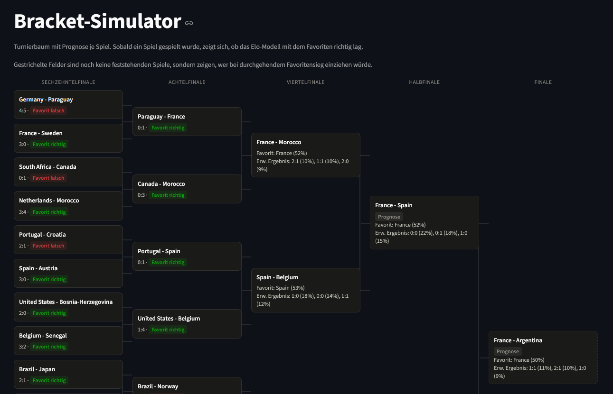
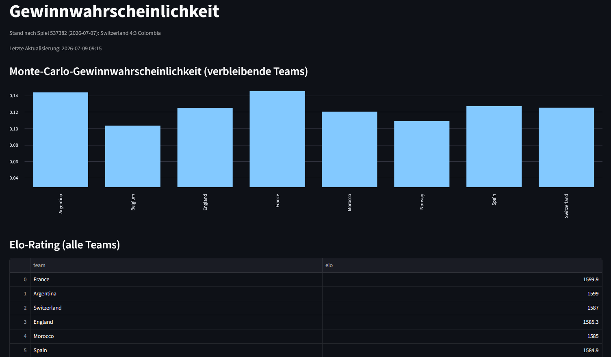

# WM 2026 Live Tournament Analytics

Ein Live-Dashboard zur WM 2026: Elo-Rating, Form-Score, Monte-Carlo-Turniersimulation
und ein Poisson-Torergebnis-Modell, gefüttert mit echten Daten von
[football-data.org](https://www.football-data.org/). Gebaut mit Python und
[Streamlit](https://streamlit.io/).




## Live-Demo

https://wm2026probabilty.streamlit.app/

## Features

Fünf Dashboard-Seiten, jede von einem eigenen Pipeline-Schritt gespeist:

1. **Gewinnwahrscheinlichkeit** — Monte-Carlo-Turniersieg-Wahrscheinlichkeit je verbleibendem
   Team (10.000 Bracket-Simulationen) plus vollständige Elo-Rangliste.
2. **Turnier-Übersicht** — alle bisherigen Ergebnisse, Tordifferenz pro Team, und ein
   Upset-Tracker (Spiele, in denen der Elo-Favorit verloren hat).
3. **Form & Momentum** — Formkurve der letzten 3 Spiele pro Team, sowie ein
   Elo-Verlauf-Vergleich zweier frei wählbarer Teams über das Turnier.
4. **Bracket-Simulator** — interaktiver Turnierbaum vom Sechzehntelfinale bis zum Finale.
   Bereits entschiedene Runden zeigen Ergebnis + ob der Favorit richtig lag; offene Runden
   zeigen die Elo-Prognose samt wahrscheinlichstem Torergebnis. Halbfinale/Finale werden,
   solange die Paarungen noch nicht feststehen, unter der Annahme durchgehender
   Favoritensiege projiziert (gestrichelt gekennzeichnet). Ein Button stößt die komplette
   Pipeline neu an, sobald neue Ergebnisse vorliegen.
5. **Verlauf** — tägliche Snapshots der Prognosen; erlaubt den Abgleich "was hat das
   Modell an Tag X vorhergesagt" gegen das inzwischen bekannte tatsächliche Ergebnis.

## Methodik

- **Elo-Rating**: Start bei 1500 für alle Teams (die kostenlose football-data.org-API
  liefert kein FIFA-Ranking zur Initialisierung). K-Faktor 40 in der Gruppenphase,
  50 in der K.-o.-Runde.
- **Form-Score**: letzte 3 Spiele, gewichtet 3/2/1 (jüngstes Spiel zählt am meisten).
- **Monte-Carlo-Simulation**: 10.000 Durchläufe des Rest-Turniers, Spielausgang je
  Partie über die Elo-Erwartungswert-Formel gewürfelt. Paarungen für Runden, deren
  Teilnehmer die API noch nicht kennt (z. B. Halbfinale vor Ende des Viertelfinals),
  werden nach Standard-Bracket-Konvention angenommen (Sieger Spiel 1 vs. Sieger Spiel 2, …).
- **Score-Prognose**: einfaches Poisson-Modell — Angriffs-/Abwehrstärke je Team relativ
  zum Turnierschnitt, daraus erwartete Tore pro Team, daraus eine Poisson-Verteilung
  möglicher Ergebnisse. Kleine Stichproben (erst wenige Spiele pro Team) werden per
  Shrinkage Richtung Turnierschnitt geglättet, damit z. B. ein bisher torloses Team nicht
  fälschlich als "kann nie ein Gegentor kassieren" modelliert wird. Kein Heimvorteil, da
  WM-Spiele an neutralen Orten stattfinden.

## Setup

```bash
git clone <repo-url>
cd wm2026

python -m venv venv
venv\Scripts\activate        # Windows
# source venv/bin/activate   # macOS/Linux

pip install -r requirements.txt

cp .env.example .env
# FOOTBALL_DATA_API_KEY in .env eintragen
```

Pipeline einmal komplett durchlaufen lassen:

```bash
python src/fetch_data.py
python src/process_data.py
python src/elo.py
python src/form.py
python src/monte_carlo.py
python src/score_prediction.py
python src/snapshot.py
```

Dashboard starten:

```bash
streamlit run streamlit_app/app.py
```

Nach neuen Ergebnissen genügt ein Klick auf "Daten aktualisieren" auf der
Bracket-Simulator-Seite — das ruft die komplette Pipeline erneut auf.

## Projektstruktur

```
data/
  raw/                 rohe API-Antworten (JSON)
  processed/           aufbereitete CSVs, von den src/-Skripten erzeugt
    snapshots/<datum>/ tägliche Kopien für den Verlauf
src/
  fetch_data.py         API-Anbindung
  process_data.py       Rohdaten -> matches_clean.csv
  elo.py                Elo-Modell + Spielhistorie
  form.py               Form-Score
  monte_carlo.py        Turniersieg-Simulation
  score_prediction.py   Poisson-Torergebnis-Modell
  bracket.py            gemeinsame Turnierbaum-Logik (Rundenreihenfolge, Verkettung)
  snapshot.py           tägliches Snapshot der processed-Daten
streamlit_app/
  app.py                Startseite
  pages/                die 5 Dashboard-Seiten
```

## Bekannte Einschränkungen

- Start-Elo ist für alle Teams gleich (1500) statt FIFA-Ranking-basiert, da die
  kostenlose API-Stufe kein Ranking liefert.
- Halbfinal-/Finalpaarungen vor offizieller Bestätigung sind eine Annahme
  (Standard-Bracket-Verkettung), keine garantierte Vorhersage der tatsächlichen Paarung.
- Score-Prognose ist ein vereinfachtes, unabhängiges Poisson-Modell ohne
  Dixon-Coles-Korrektur für niedrige Ergebnisse.
- Datenaktualisierung ist bewusst manuell (Button statt Cron/GitHub Actions) - für die
  restlichen Turniertage ausreichend.
